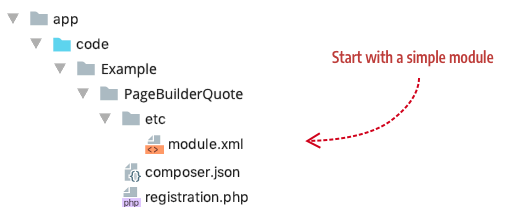
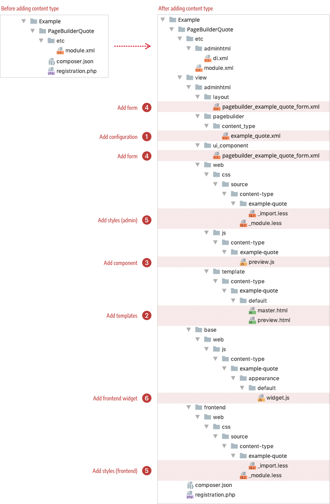

<!--  -->

# Overview

{: .bs-callout .bs-callout-warning }
The development of this tutorial is currently **IN PROGRESS**. A more complete rough draft is available in the How Tos section here: [How to develop a new content type](docs/how-to/how-to-develop-new-content-type.md). When this tutorial is complete, it will replace the equivalent How To topic.

Out of the box, Page Builder comes with several content types (controls) that you can drag onto the stage to build your storefront pages, as shown below. In this topic, you will learn how to create your own content type for use within Page Builder.

## Prerequisites

Page Builder creates content types from modules. So this topic assumes you have a basic module structure in which to add your content type files.

## Overview

An overview of the steps for creating a Page Builder content type are briefly illustrated and described here.

1. **Add configuration**: Create an XML file to setup all the other files that control the appearances and behaviors of your content type.  
2. **Add templates**: Create HTML files that define the appearance of your content types on the Admin stage (preview.html) and the storefront (master.html).
3. **Add component**: Create a JavaScript file that define the behavior of your content type on the Admin stage (preview.js) and the storefront (master.js).
4. **Add editor**: Create a UI component (XML file) and a layout to give users the ability to add or edit content using your content type.
5. **Add styles**: Create LESS files to style your content types when rendered in the Admin UI and on the storefront. 
6. **Add frontend widget**: Create a JavaScript file to control the UI behavior (user interactivity) of your content type on the storefront.  

## Content type files

The files you will need to create in order to build a basic content type are shown here.

This tutorial walks you through creating these files, starting with [Step 1: Add configuration](step-1-add-configuration.md).

<!--  -->