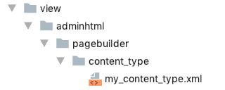

<!--  -->

# Step 1: Add configuration

Creating a configuration file is the first step to creating a new content type. Through the configuration file, you can specify things like the label, location, and icon of your content type within the Page Builder panel menu. You can specify where your content type can be dropped on the stage, and reference the many other files you will use to control the appearance and behavior your content type.

## Create the configuration file

1. Create a new XML file in the following directory structure of your module: `view/adminhtml/pagebuilder/content_type/my-content-type.xml`. 

    

2. Copy the contents of this example into your `my-content-type.xml` file. Element descriptions follow:

``` xml
<?xml version="1.0"?>
<config xmlns:xsi="http://www.w3.org/2001/XMLSchema-instance" xsi:noNamespaceSchemaLocation="urn:magento:module:Magento_PageBuilder:etc/content_type.xsd">
    <type name="my-content-type"
          label="My Content Type"
          group="layout"
          component="Magento_PageBuilder/js/content-type-collection"
          preview_component="Magento_PageBuilder/js/content-type/preview"
          master_component="Magento_PageBuilder/js/content-type/master"
          form=""
          icon=""
          sortOrder="-1"
          is_hideable="true"
          translate="label">
        <appearances>
            <appearance name="default"
                        default="true"
                        preview_template="Vendor_Module/content-type/my-content-type/default/preview"
                        render_template="Vendor_Module/content-type/my-content-type/default/master"
                        reader="Magento_PageBuilder/js/master-format/read/configurable">
                <elements>
                    <element name="main">
                        <attribute name="name" source="data-role"/>
                        <attribute name="appearance" source="data-appearance"/>
                    </element>
                </elements>
            </appearance>
        </appearances>
    </type>
</config>
```

**Line 2**: The `content-type.xsd` schema that defines the elements for you config file can be found here: `magento2-page-builder/app/code/Magento/PageBuilder/et/content_type.xsd`.

**Line 3-13:** Attributes of the <type> element define several key properties of your content type as follows:

| Attribute | Description                                                  |
| :-------- | ------------------------------------------------------------ |
| name      | Name for your content type. The convention for using multi-word names is to separate the words with hyphens. |
| label     | Label that displays in the Page Builder panel, option menu, and on the Admin stage. |
| group     | Group or category in the panel menu where your content type is displayed. The default groups are Layout, Elements, Media, and Add Content. See [Panel configurations](../configurations/panel-configurations.md) for more details. |
| component |                                                              |
|           |                                                              |
|           |                                                              |
|           |                                                              |
|           |                                                              |
|           |                                                              |

If you try to view Page Builder at this point, Page Builder will throw an error noting that the `preview_template` and `render_template` from the `<appearance` element are missing. These templates are required before we can add our content type to Page Builder. Let's do that in [Step 2: Add templates](step-2-add-templates.md).

<!--  -->