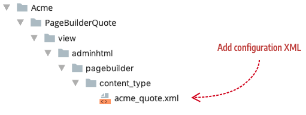

<!--  -->
{: .bs-callout .bs-callout-warning }
The development of this tutorial is currently **IN PROGRESS**, **INCOMPLETE**, and potentially **INCORRECT**. The expected completion time is Nov. 27.

# Step 1: Add configuration

The configuration file gives your content type its existence. It's where you set the name, display label, and references to the other files that define the appearance and behavior of your content type.

{: .bs-callout .bs-callout-info }
Only a subset of configuration elements are described here (enough to understand the configuration file's role within a content type). For more details, refer to [Main configurations](../configurations/content-type-configuration.md) and [Additional configurations](../configurations/additional-configurations.md).

## Location

Add your configuration file here (`view/adminhtml/pagebuilder/content_type/`):



The file name should reflect the name of your content type, using underscores to separate multi-word names as needed. 

## Example

The following configuration shows the minimal requirements for defining a content type, described in the tables that follow.

``` xml
<?xml version="1.0"?>
<config xmlns:xsi="http://www.w3.org/2001/XMLSchema-instance" xsi:noNamespaceSchemaLocation="urn:magento:module:Magento_PageBuilder:etc/content_type.xsd">
    <type name="my-content-type"
          label="My Content Type"
          group="layout"
          component="Magento_PageBuilder/js/content-type-collection"
          preview_component="Magento_PageBuilder/js/content-type/preview"
          master_component="Magento_PageBuilder/js/content-type/master"
          form=""
          icon=""
          sortOrder="100"
          is_hideable="false"
          translate="label">
        <appearances>
            <appearance name="default"
                        default="true"
                        preview_template="Vendor_Module/content-type/my-content-type/default/preview"
                        render_template="Vendor_Module/content-type/my-content-type/default/master"
                        reader="Magento_PageBuilder/js/master-format/read/configurable">
                <elements>
                    <element name="main">
                        <attribute name="name" source="data-role"/>
                        <attribute name="appearance" source="data-appearance"/>
                    </element>
                </elements>
            </appearance>
        </appearances>
    </type>
</config>
```

## The `type` node

The `<type>` node defines the key properties of your content type. The attributes are described here:

| Attribute         | Description                                                  |
| :---------------- | ------------------------------------------------------------ |
| name              | Name of the content type that Magento uses for XML merging. The convention for using multi-word names is to separate the words with hyphens. |
| label             | Label displayed in the Page Builder panel, option menu, and on the Admin stage. |
| group             | Group or category in the panel menu where your content type is displayed. The default groups are Layout, Elements, Media, and Add Content. See [Panel configurations](../configurations/panel-configurations.md) for more details. |
| component         | Currently there are two component types to choose from: `content-type` and `content-type-collection`. Use `Magento_PageBuilder/js/content-type` for static content types that do not have children. Use `Magento_PageBuilder/js/content-type-collection` for content types that can contain children, otherwise known as container content types. |
| preview_component | JavaScript file that provides preview-specific rendering logic within the Admin UI. |
| master_component  | JavaScript file that provides master format rendering logic generic for all appearances of your content type when rendered on the storefront. |
| form              | UI component form that provides the editor for your content type. |
| icon              | Optional. PNG or SVG image displayed in the Page Builder panel alongside the label. |
| is_hideable       | Optional. Default `true`. Include it only when you want to set it to `false` to prevent the end-user from hiding your  content type on demand, using a button (eye icon) in the options menu. A setting of false will remove the hide button from the options menu. |
| translate         | Identifies the attribute you want Magento to translate. Here, the `label` value is set for translation. |
{:style="table-layout:auto"}

## The `appearance` node

The purpose of the `<appearance>` node in a configuration is to define the appearance of your content type as a preview in the Admin (using the`preview.html` template) and in the storefront for customers (using the `master.html` template).

The `<appearance>` attributes are described as follows:

| attribute        | description                                                  |
| ---------------- | ------------------------------------------------------------ |
| name             | Name of the appearance for extending as needed.              |
| default          | Content types must specify one of the appearances as the default appearance. That means if you only have one appearance, it must be set as the default. |
| preview_template | `preview.html` - the HTML template for rendering the preview appearance of a content type within the Admin. |
| render_template  | `master.html` - the HTML template for rendering the storefront appearance of a content type for customers. |
| reader           | Reads data for the content type from the master format       |
{:style="table-layout:auto"}

All content types must have at least one `<appearance>` defined within the `<appearances>` collection.

## The `element` node

**[Dave, I know the following sentence is incorrect. Please rewrite to correct it and add more information as needed. :) ]**

The purpose of the `<element>` nodes in a configuration is to map the data from the content type from the given source back to the master format so that the content type can be updated and rendered correctly within both the Admin preview and the storefront.

**[Add table to describe element attributes and nodes]**

## Next

At this point, if you try to view Page Builder you get an error noting that the `preview_template` and `render_template` from the `<appearance>` element are missing. These templates are referenced in the example config file, but we have not yet created them. Let's do that next in [Step 2: Add templates](step-2-add-templates.md).

<!--  -->