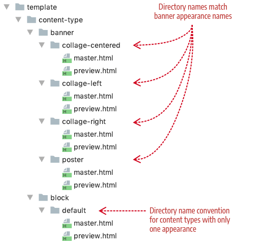
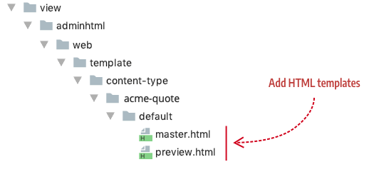

# Step 2: Add templates

***
The development of this tutorial is currently **IN PROGRESS**.

***

Content type templates are the HTML files (fragments) that define how your content type *appears* on both the Admin stage and on a storefront page. In Page Builder this is called an `appearance`, as discussed in the previous configuration step.

Each `appearance` is defined by exactly two HTML template files: `preview.html` and `master.html`. For example, if you look at the template files for the Page Builder Banner, you see a set of these templates defined for each of Banner's four appearances:



In contrast, the Block content type only has one `appearance`, so it defines it as the default with one set of master-preview template files.

## Conventions

Conventions for adding content type templates are as follows:

- Page Builder requires at least one `appearance` (two HTML templates) for every content type:  `preview.html` for the Admin stage, `master.html` for the storefront page. If your content type has only one appearance (like the Block), then it only needs these two templates.  

- Page Builder requires the names of your templates to be `preview` and `master`.

Content types cannot be rendered without these templates, so add them to your module (they can be blank initially) within the following directory structure (`view/adminhtml/web/template/content-type/<content-type-name>/default/`):



As mentioned, these files can be empty initially; they just need to exist in their proper location within your module.

## Configuration

In your configuration file, you need to reference your templates within the `<appearance>` element as follows:

```xml
<appearances>
  <appearance name="default"
              default="true"
              preview_template="Vendor_Module/content-type/quote/default/preview"
              render_template="Vendor_Module/content-type/quote/default/master"
              reader="Magento_PageBuilder/js/master-format/read/configurable">
    <elements...>
  </appearance>
</appearances>
```

| Attribute        | Description                                                  |
| ---------------- | ------------------------------------------------------------ |
| `preview_template` | References the`preview.html` template for rendering the preview appearance of your content type on the stage within the Admin UI. |
| `render_template`  | References the `master.html`  template for rendering the appearance of your content type on the storefront for customers to see. |


The remainder of this topic is in progress.