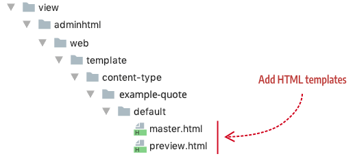
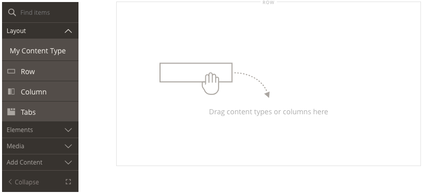

# Step 2: Add templates

***
The development of this tutorial is currently **IN PROGRESS**.

***

Templates are the HTML files that define the appearance of content types within both the Admin UI (using the `preview.html`) and the storefront UI (using the `master.html`). 

### Configuration

In your configuration file, reference your templates as shown here within the `<appearance>` element:

```xml
<appearance name="default"
            default="true"
            preview_template="Vendor_Module/content-type/example/default/preview" 
            render_template="Vendor_Module/content-type/example/default/master"
            reader="Magento_PageBuilder/js/master-format/read/configurable">
```


| Attribute        | Description                                                  |
| ---------------- | ------------------------------------------------------------ |
| `preview_template` | `preview.html` - the HTML template for rendering the preview appearance of a content type on the stage within the Admin UI. |
| `render_template`  | `master.html` - the HTML template for rendering the appearance of a content type on the storefront for customers to see. |

## Location

Content types cannot be rendered without these templates. Add them to your module here (`view/adminhtml/web/template/content-type/<content-type-name>/default/`):




## Create the `preview_template`

1. Create the `preview.html` file (as noted above) using the example content that follows.
    ```html
    <!--preview.html-->
    <div class="pagebuilder-content-type" 
         event="{ mouseover: onMouseOver, mouseout: onMouseOut }, mouseoverBubble: false">
      <render args="getOptions().template" />
      <h2 attr="data.main.attributes" 
          ko-style="data.main.style" 
          css="data.main.css" 
          data-bind="liveEdit: { field: 'example_text', placeholder: $t('Edit Example Text') }">
      </h2>
    </div>
    ```

2. Flush your config cache `bin/magento cache:flush config` and view Page Builder from the Home Page editor (as a convenience for storefront viewing later). The Page Builder panel menu should show your content type at the top of the layout group:

    

3. Drag your new content type onto the stage and **Save**. You should see something similar to this:

     

    Notice that you also have an options menu when you hover over your content type. This is provided by including the `<render args="getOptions().template" />` within your `preview.html` template. See [Option menu configurations](option-menu-configurations.md) for more details.

## Create the `master_template`


```html
<!--master.html-->
<h2 attr="data.main.attributes" 
    ko-style="data.main.style" 
    css="data.main.css" 
    html="data.main.html">
</h2>
```