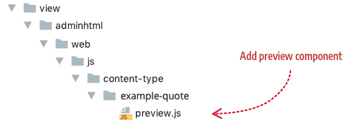

# Step 3: Add components (optional)

***
The development of this tutorial is currently **IN PROGRESS**.

***

Components are the JavaScript files that define the behaviors of your content type when they appear on the stage in the Admin UI (using the `preview.js` component) and in the storefront (using the `master.js` component). As such, they are complementary to the templates you added previously in Step 2. 

## Configuration

In your configuration file, reference your JavaScript component (`preview.js`) as shown here within the `<type>` element:

```XML
<config xmlns:xsi="http://www.w3.org/2001/XMLSchema-instance" 
        xsi:noNamespaceSchemaLocation="urn:magento:module:Magento_PageBuilder:etc/content_type.xsd">
  <type name="example"
        label="Example"
        component="Magento_PageBuilder/js/content-type"
        preview_component="Vendor_Module/js/content-type/example/preview"
        master_component="Magento_PageBuilder/js/content-type/master"
        ...
```

| Attribute         | Description                                                  |
| ----------------- | ------------------------------------------------------------ |
| component         | Currently there are two component types to choose from: `content-type` and `content-type-collection`. Use `Magento_PageBuilder/js/content-type` for static content types that do not have children (as shown in the example). Use `Magento_PageBuilder/js/content-type-collection` for content types that can contain children, called container content types. |
| preview_component | `preview.js` - Optional JavaScript file that provides preview-specific rendering logic within the Admin UI. If your content type does not require any specific user-interactivity or other behavior in the Admin, you can simply omit this attribute from the the `<type>`. Page Builder will use `Magento_PageBuilder/js/content-type/preview` by default. |
| master_component  | `master.js` - Optional JavaScript file that provides master format rendering logic generic for all appearances of your content type when rendered on the storefront. Same as with the `preview_component`, if your content type does not require any specific user-interactivity or other behavior when it's displayed in the storefront, you can simply omit this attribute from the the `<type>`. Page Builder will use `Magento_PageBuilder/js/content-type/master` by default (as shown in the example). |

{:style="table-layout:auto"}

## Location

Add them to your module here (`view/adminhtml/web/js/content-type/<content-type-name>/`):



## Create preview component
