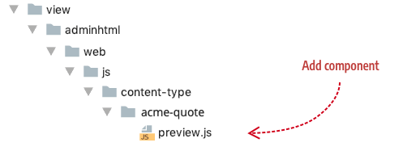

# Step 3: Add components (optional)

***
The development of this tutorial is currently **IN PROGRESS**.

***

Components are the JavaScript files that define the behaviors of your content type when they appear on the stage in the Admin UI (using the `preview.js` component) and in the storefront (using the `master.js` component). As such, they are complementary to the templates you added previously in Step 2, acting as the view models to the template's views. 

## Configuration

In your configuration file, reference your JavaScript component (`preview.js`) as shown here within the `type` element:

```xml
<config xmlns:xsi="http://www.w3.org/2001/XMLSchema-instance" 
        xsi:noNamespaceSchemaLocation="urn:magento:module:Magento_PageBuilder:etc/content_type.xsd">
  <type name="example_quote"
        label="Quote"
        component="Magento_PageBuilder/js/content-type"
        preview_component="Example_PageBuilderQuote/js/content-type/example_quote/preview"
        master_component="Magento_PageBuilder/js/content-type/master">
        ...
  </type>
</config>
```

The following table describes each component-related attribute from the Quote configuration.

| Attribute           | Description                                                  |
| ------------------- | ------------------------------------------------------------ |
| `component`         | There are two component types to choose from: `content-type` and `content-type-collection`. Use `Magento_PageBuilder/js/content-type` for static content types that do not have children (like our Quote). Use `Magento_PageBuilder/js/content-type-collection` for content types that can contain children (container content types). |
| `preview_component` | Optional. The `preview.js` file provides rendering logic to the Admin preview template. If your content type does not require any changes to the standard option menu (shown on mouseover) for a content type or other user-interactivity in the Admin, you can omit this attribute from the the `type` element. When you omit this attribute, Page Builder will use `Magento_PageBuilder/js/content-type/preview` by default. |
| `master_component`  | Optional. The `master.js` file provides rendering logic to the master format storefront template. As with the `preview_component`, if your content type does not require any specific user-interactivity or other behavior when it's displayed in the storefront, you can simply omit this attribute from the the `type` element. When you omit this attribute, Page Builder will use `Magento_PageBuilder/js/content-type/master` by default. In |

## Location

Add them to your module here (`view/adminhtml/web/js/content-type/example-quote/`):



## Create preview component

The remainder of this topic is in progress.