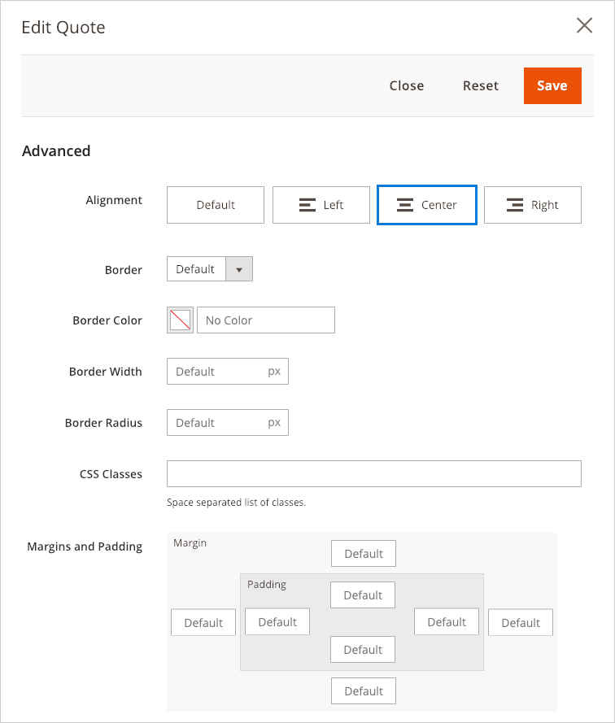
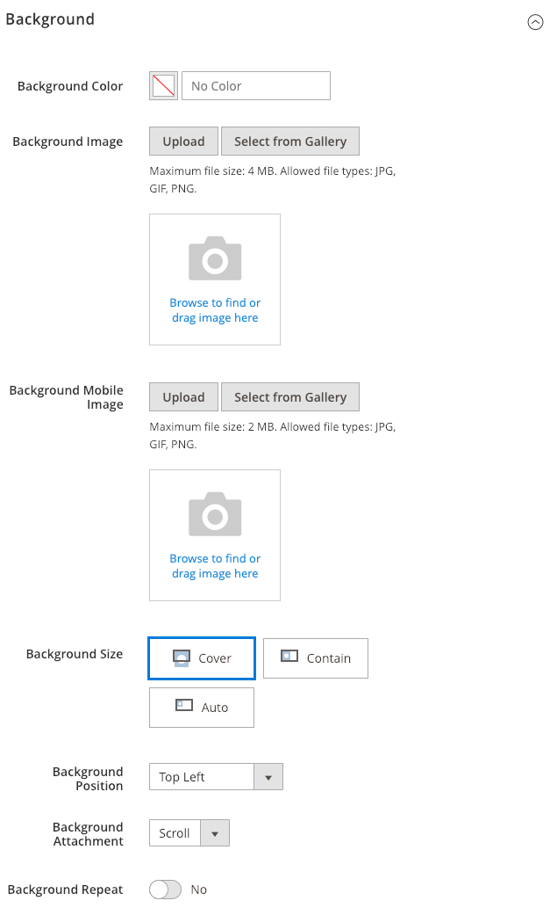

# Step 4: Add form

***
The development of this tutorial is currently **IN PROGRESS**.

***

In this step, we will create a UI component form to give our Quote example an editor we can use to edit content and style its appearance in various ways.

## About forms

Page Builder provides two base forms that give you a ton of functionality you can inherit from right out-of-the-box:

- `pagebuilder_base_form`

- `pagebuilder_base_form_with_background_attributes` (inherits from `pagebuilder_base_form`)

Inheriting from either base form gives you an editor for your content type that slides out from the right side of the Admin screen. 

### `pagebuilder_base_form`

The `pagebuilder_base_form` gives you the following form fields in the editor, along with the Close, Reset, and Save buttons as shown here:

 


### `pagebuilder_base_form_with_background_attributes`

In addition the the "Advanced" form fields from `pagebuilder_base_form`,  the `pagebuilder_base_form_with_background_attributes` gives you the following "Background" form fields as shown here:



The base form you decide to inherit from depends on the type of content type you create and/or the level of customization you want to give to end-users.

## Form and layout conventions

The conventions for naming your form and its layout are as follows:

- Your form should be named `pagebuilder_` + `content_type_name_` + `form.xml`. For example `pagebuilder_example_quote_form.xml`
- The layout for the form must match the name of your form, in this case: `pagebuilder_example_quote_form.xml`.

The form and layout files should be added to your module in the following locations:

- `view/adminhtml/layout/`
- `view/adminhtml/ui_component/`


Make sure you add these files as shown before continuing.

## Form configuration

In your configuration file, reference your UI component form as shown here within the `<type>` element:

```xml
<config xmlns:xsi="http://www.w3.org/2001/XMLSchema-instance" 
        xsi:noNamespaceSchemaLocation="urn:magento:module:Magento_PageBuilder:etc/content_type.xsd">
  <type name="example_quote"
        label="Quote"
        form="pagebuilder_example_quote_form"
        ...>
```

| Attribute | Description                                                  |
| --------- | ------------------------------------------------------------ |
| `form`      | `pagebuilder_example_quote_form` - UI component form that provides the form editor for your content type. |

### Configuration elements

As mentioned previously in the add configuration step, the `elements` section, within the `appearance` of your configuration file, maps the data and the styles from your form to the content type's master format so that the values entered in the form can be stored and rendered correctly on the Admin stage and storefront.

The following elements are from the `example_quote.xml` configuration. The elements are shown here in full, followed by descriptions of the key attributes:

```xml
<elements>
  <element name="main">
    <style name="text_align" source="text_align"/>
    <style name="border" source="border_style" converter="Magento_PageBuilder/js/converter/style/border-style"/>
    <style name="border_color" source="border_color"/>
    <style name="background_color" source="background_color"/>
    <style name="background_image" source="background_image" converter="Magento_PageBuilder/js/converter/style/background-image" preview_converter="Magento_PageBuilder/js/converter/style/preview/background-image"/>
    <style name="border_width" source="border_width" converter="Magento_PageBuilder/js/converter/style/border-width"/>
    <style name="border_radius" source="border_radius" converter="Magento_PageBuilder/js/converter/style/remove-px"/>
    <style name="margins" storage_key="margins_and_padding" reader="Magento_PageBuilder/js/property/margins" converter="Magento_PageBuilder/js/converter/style/margins"/>
    <style name="padding" storage_key="margins_and_padding" reader="Magento_PageBuilder/js/property/paddings" converter="Magento_PageBuilder/js/converter/style/paddings"/>
    <style name="display" source="display" converter="Magento_PageBuilder/js/converter/style/display" preview_converter="Magento_PageBuilder/js/converter/style/preview/display"/>
    <attribute name="name" source="data-role"/>
    <attribute name="appearance" source="data-appearance"/>
    <css name="css_classes"/>
  </element>
  <element name="quote">
    <style name="text_align" source="text_align"/>
    <html name="quote_text" converter="Magento_PageBuilder/js/converter/html/tag-escaper"/>
    <css name="quote_css"/>
  </element>
  <element name="author">
    <style name="text_align" source="text_align"/>
    <html name="quote_author" converter="Magento_PageBuilder/js/converter/html/tag-escaper"/>
  </element>
  <element name="author_title">
    <style name="text_align" source="text_align"/>
    <html name="quote_author_desc" converter="Magento_PageBuilder/js/converter/html/tag-escaper"/>
  </element>
</elements>
```

#### element

The `<element>` element provides a scope for the data bindings within it.

| Attribute | Description                                                  |
| --------- | ------------------------------------------------------------ |
| `name`    | Specifies the name of the element scope for the data binding when applied to template elements. In our example, the element name of `main` is used as the scope for binding styles and other attributes to the top-level `<div>` element in our template: `<div attr="data.main.attributes" ko-style="data.main.style">` |

#### style

The `<style>` element configures the bindings from the form style fields to the template elements.

| Attribute           | Description                                                  |
| ------------------- | ------------------------------------------------------------ |
| `name`              | By convention, the name of the element should match the source. |
| `source`            | The name of the form field you want the style bound to.      |
| `converter`         | [Please add description/purpose]                             |
| `preview_converter` | [Please add description/purpose]                             |
| `storage_key`       | [Please add description/purpose]                             |
| `reader`            | [Please add description/purpose]                             |

#### attribute

The `<attribute>` element provides... [Please describe the purpose of this element.]

| Attribute | Description                                                  |
| --------- | ------------------------------------------------------------ |
| `name`    | [Please add description/purpose as it applies to the code example above] |
| `source`  | [Please add description/purpose as it applies to the code example above] |

#### css

The `<css>` element sets the binding for the CSS Classes form field (`css_classes`) from the `pagebuilder_base_form`, or from any custom input field you add to your form. When the `<css>` element is defined, class names entered into the CSS Classes field are applied to the template elements that use them.

| Attribute | Description                                      |
| --------- | ------------------------------------------------ |
| `name`    | Specifies the name of the form field to bind to. |

For example, in our Quote configuration, we define an  `<element>` named `quote` with a `<css>` element bound to an input field in our form named `quote_css`, as shown here: 

```xml
<!-- from example_quote.xml -->
<element name="quote">
	...
  <css name="quote_css"/>
</element>
```

The corresponding `quote_css` form field is shown here:

```xml
<!-- from pagebuilder_example_quote_form.xml -->
<field name="quote_css" sortOrder="40" formElement="input">
  <argument name="data" xsi:type="array">
    <item name="config" xsi:type="array">
      <item name="source" xsi:type="string">page</item>
    </item>
  </argument>
  <settings>
    <dataScope>quote_css</dataScope>
    <dataType>text</dataType>
    <label translate="true">CSS for Quote</label>
  </settings>
</field>
```

And the application of the binding in the `preview.html` template is shown here:

```html
<!-- from preview.html -->
<blockquote css="data.quote.css" ...></blockquote>
```

#### html

The `<html>` element binds the HTML content entered in a form field. When the `<html>` element names a field for binding, content entered into the field is applied to the template elements that use them.

| Attribute | Description                                      |
| --------- | ------------------------------------------------ |
| `name`    | Specifies the name of the form field to bind to. |

For example, as with the previous `css` binding, the Quote configuration defines the `<element>` named `quote` with an `<html>` element that is bound to an input field in our form named `quote_text`, as shown here: 

```xml
<!-- from example_quote.xml -->
<element name="quote">
  ...
  <html name="quote_text" converter="Magento_PageBuilder/js/converter/html/tag-escaper"/>
  <css name="quote_css"/>
</element>
```

The corresponding `quote_text` form field is shown here:

```xml
<!-- from pagebuilder_example_quote_form.xml -->
<field name="quote_text" sortOrder="10" formElement="textarea">
  <argument name="data" xsi:type="array">
    <item name="config" xsi:type="array">
      <item name="source" xsi:type="string">page</item>
    </item>
  </argument>
  <settings>
    <dataScope>quote_text</dataScope>
    <dataType>text</dataType>
    <label translate="true">Quote</label>
  </settings>
</field>
```

And the application of the binding in the `master.html` template is shown here:

```html
<!-- from master.html -->
<blockquote css="data.quote.css" html="data.quote.html"></blockquote>
```

## Quote form

The Quote form inherits from `pagebuilder_base_form_with_background_attributes` to provide all the form fields available for customizing our content type. In addition to the fields we get from inheritance, we want to add specific entry and styling fields for our Quote, as shown here:


The Quote form is shown in full here for you to copy into your `pagebuilder_example_form.xml` file, followed by descriptions of the key parts.

```xml
<?xml version="1.0" encoding="UTF-8"?>
<form xmlns:xsi="http://www.w3.org/2001/XMLSchema-instance" xsi:noNamespaceSchemaLocation="urn:magento:module:Magento_Ui:etc/ui_configuration.xsd" extends="pagebuilder_base_form_with_background_attributes">
  <argument name="data" xsi:type="array">
    <item name="js_config" xsi:type="array">
      <item name="provider" xsi:type="string">pagebuilder_example_quote_form.pagebuilder_example_quote_form_data_source</item>
    </item>
    <item name="label" xsi:type="string" translate="true">Quote</item>
  </argument>
  <settings>
    <namespace>pagebuilder_example_quote_form</namespace>
    <deps>
      <dep>pagebuilder_example_quote_form.pagebuilder_example_quote_form_data_source</dep>
    </deps>
  </settings>
  <dataSource name="pagebuilder_example_quote_form_data_source">
    <argument name="data" xsi:type="array">
      <item name="js_config" xsi:type="array">
        <item name="component" xsi:type="string">Magento_PageBuilder/js/form/provider</item>
      </item>
    </argument>
    <dataProvider name="pagebuilder_example_quote_form_data_source" class="Magento\PageBuilder\Model\ContentType\DataProvider">
      <settings>
        <requestFieldName/>
        <primaryFieldName/>
      </settings>
    </dataProvider>
  </dataSource>
  <fieldset name="general" sortOrder="20">
    <settings>
      <label/>
    </settings>
    <field name="quote_text" sortOrder="10" formElement="textarea">
      <argument name="data" xsi:type="array">
        <item name="config" xsi:type="array">
          <item name="source" xsi:type="string">page</item>
        </item>
      </argument>
      <settings>
        <dataScope>quote_text</dataScope>
        <dataType>text</dataType>
        <label translate="true">Quote</label>
      </settings>
    </field>
    <field name="quote_author" sortOrder="20" formElement="input">
      <argument name="data" xsi:type="array">
        <item name="config" xsi:type="array">
          <item name="source" xsi:type="string">page</item>
        </item>
      </argument>
      <settings>
        <dataScope>quote_author</dataScope>
        <dataType>text</dataType>
        <label translate="false">Author</label>
      </settings>
    </field>
    <field name="quote_author_desc" sortOrder="30" formElement="input">
      <argument name="data" xsi:type="array">
        <item name="config" xsi:type="array">
          <item name="source" xsi:type="string">page</item>
        </item>
      </argument>
      <settings>
        <dataScope>quote_author_desc</dataScope>
        <dataType>text</dataType>
        <label translate="false">Author Description</label>
      </settings>
    </field>
    <field name="quote_css" sortOrder="40" formElement="input">
      <argument name="data" xsi:type="array">
        <item name="config" xsi:type="array">
          <item name="source" xsi:type="string">page</item>
        </item>
      </argument>
      <settings>
        <dataScope>quote_css</dataScope>
        <dataType>text</dataType>
        <label translate="true">CSS for Quote</label>
      </settings>
    </field>
  </fieldset>
</form>
```

### fieldset

The `<fieldset>` element is required and provides a basic grouping mechanism (with an optional label) for the fields in your form. You can define as many fieldsets as you want.

| Attribute   | Description                                                  |
| ----------- | ------------------------------------------------------------ |
| `name`      | _What significance or conventions apply to the fieldset name?_ |
| `sortOrder` | Determines where the fieldset is placed in the editor. The `sortOrder` for the `pagebuilder_base_form` fieldset is set to `90`. Setting your fieldset to a value less than that (such as `20`) will put your fieldset above the inherited fieldsets. A value greater than `90` will put your fieldset below the inherited fieldsets. |

### field

The `<field>` element creates the actual HTML form element as specified by the `formElement` attribute, such as input, select, textarea, and colorPicker.

| Attribute     | Description                                                  |
| ------------- | ------------------------------------------------------------ |
| `name`        | The name of the field used for bindings.                     |
| `sortOrder`   | Determines where the field is placed within the fieldset in relation to other fields. |
| `formElement` | Determines the HTML form element to render for the field.    |

### argument data source

Defines the data source for the field. 

[Need more info. What does it mean for the `page` to be specified as the data source?]

```xml
<argument name="data" xsi:type="array">
  <item name="config" xsi:type="array">
    <item name="source" xsi:type="string">page</item>
  </item>
</argument>
```

### settings

The `<settings>` element defines the data scope, data type, and label to use for the field, as shown here:

```xml
<settings>
  <dataScope>quote_text</dataScope>
  <dataType>text</dataType>
  <label translate="true">Quote</label>
</settings>
```
The `dataType` values are typically `text` and `boolean`.

[What is the dataScope? What's its significance? How is it used?]

## Quote form layout

The layout for our Quote form is shown in full here for you to copy into your `pagebuilder_example_form.xml` layout file. For more information about layouts, see [Layout instructions](https://devdocs.magento.com/guides/v2.3/frontend-dev-guide/layouts/xml-instructions.html).

```xml
<?xml version="1.0"?>
<page xmlns:xsi="http://www.w3.org/2001/XMLSchema-instance" layout="admin-1column" xsi:noNamespaceSchemaLocation="urn:magento:framework:View/Layout/etc/page_configuration.xsd">
    <update handle="styles"/>
    <body>
        <referenceContainer name="content">
            <uiComponent name="pagebuilder_example_quote_form"/>
        </referenceContainer>
    </body>
</page>
```

## Next

[Step 5: Add styles](step-5-add-styles.md)

