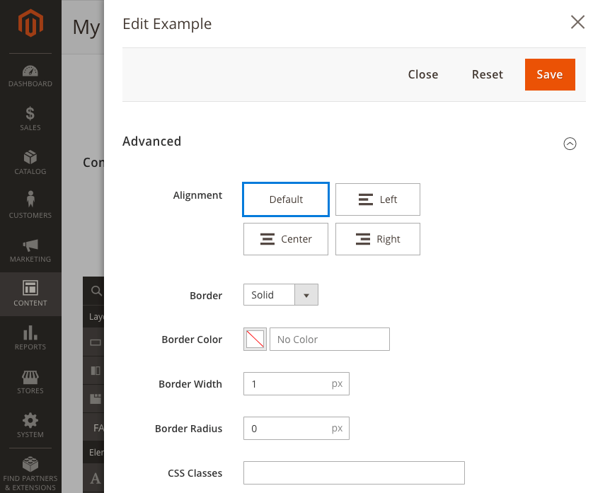

# Step 4: Add form

{: .bs-callout .bs-callout-info }
The development of this tutorial is currently **IN PROGRESS**.

Page Builder provides an editor that slides out from the right of the screen within the Admin UI to give you a way to add content and customize the appearance of your content type, as shown in the screen shot. To use and customize this editor for your needs, you need to create a UI component form along with the layout to display that form.



## Configuration

In your configuration file, reference your UI component form as shown here within the `<type>` element:

```xml
<config xmlns:xsi="http://www.w3.org/2001/XMLSchema-instance" 
        xsi:noNamespaceSchemaLocation="urn:magento:module:Magento_PageBuilder:etc/content_type.xsd">
  <type name="example"
        label="Example"
        form="pagebuilder_example_form"
        ...
```

| Attribute | Description                                                  |
| --------- | ------------------------------------------------------------ |
| form      | `pagebuilder_example_form.xml` - UI component form that provides the editor for your content type. |
{:style="table-layout:auto"}

## Location

Add the layout and form to your module as shown here:

- `view/adminhtml/web/layout/`
- `view/adminhtml/web/ui-component/`


## Create UI component form

In this example, let's create a form that extends `pagebuilder_base_form` to provide form controls for editing our content type. The code is provided here followed by descriptions of the key parts.

```xml
<?xml version="1.0" encoding="UTF-8"?>
<form xmlns:xsi="http://www.w3.org/2001/XMLSchema-instance" xsi:noNamespaceSchemaLocation="urn:magento:module:Magento_Ui:etc/ui_configuration.xsd" extends="pagebuilder_base_form">
  <argument name="data" xsi:type="array">
    <item name="js_config" xsi:type="array">
      <item name="provider" xsi:type="string">pagebuilder_example_form.pagebuilder_example_form_data_source</item>
    </item>
    <item name="label" xsi:type="string" translate="true">Heading</item>
  </argument>
  <settings>
    <deps>
      <dep>pagebuilder_example_form.pagebuilder_example_form_data_source</dep>
    </deps>
  </settings>
  <dataSource name="pagebuilder_example_form_data_source">
    <argument name="data" xsi:type="array">
      <item name="js_config" xsi:type="array">
        <item name="component" xsi:type="string">Magento_PageBuilder/js/form/provider</item>
      </item>
    </argument>
    <dataProvider name="pagebuilder_example_form_data_source" class="Magento\PageBuilder\Model\ContentType\DataProvider">
      <settings>
        <requestFieldName/>
        <primaryFieldName/>
      </settings>
    </dataProvider>
  </dataSource>
  <fieldset name="appearance_fieldset" component="Magento_PageBuilder/js/form/element/dependent-fieldset">
    <settings>
      <label translate="true">Appearance</label>
      <additionalClasses>
        <class name="admin__fieldset-visual-select-large">true</class>
      </additionalClasses>
      <collapsible>false</collapsible>
      <opened>true</opened>
      <imports>
        <link name="hideFieldset">${$.name}.appearance:options</link>
        <link name="hideLabel">${$.name}.appearance:options</link>
      </imports>
    </settings>
    <field name="appearance" formElement="select" sortOrder="10" component="Magento_PageBuilder/js/form/element/dependent-visual-select">
      <argument name="data" xsi:type="array">
        <item name="config" xsi:type="array">
          <item name="default" xsi:type="string">default</item>
        </item>
      </argument>
      <settings>
        <additionalClasses>
          <class name="admin__field-wide">true</class>
          <class name="admin__field-visual-select-container">true</class>
        </additionalClasses>
        <dataType>text</dataType>
        <validation>
          <rule name="required-entry" xsi:type="boolean">true</rule>
        </validation>
        <elementTmpl>Magento_PageBuilder/form/element/visual-select</elementTmpl>
      </settings>
      <formElements>
        <select>
          <settings>
            <options class="AppearanceSourceHeading"/>
          </settings>
        </select>
      </formElements>
    </field>
  </fieldset>
  <fieldset name="general" sortOrder="20">
    <settings>
      <label/>
    </settings>
    <field name="heading_type" sortOrder="10" formElement="select">
      <argument name="data" xsi:type="array">
        <item name="config" xsi:type="array">
          <item name="source" xsi:type="string">page</item>
          <item name="default" xsi:type="string">h2</item>
        </item>
      </argument>
      <settings>
        <label translate="true">Heading Type</label>
        <dataType>text</dataType>
        <dataScope>heading_type</dataScope>
      </settings>
      <formElements>
        <select>
          <settings>
            <options>
              <option name="h1" xsi:type="array">
                <item name="value" xsi:type="string">h1</item>
                <item name="label" xsi:type="string" translate="false">H1</item>
              </option>
              <option name="h2" xsi:type="array">
                <item name="value" xsi:type="string">h2</item>
                <item name="label" xsi:type="string" translate="false">H2</item>
              </option>
              <option name="h3" xsi:type="array">
                <item name="value" xsi:type="string">h3</item>
                <item name="label" xsi:type="string" translate="false">H3</item>
              </option>
              <option name="h4" xsi:type="array">
                <item name="value" xsi:type="string">h4</item>
                <item name="label" xsi:type="string" translate="false">H4</item>
              </option>
              <option name="h5" xsi:type="array">
                <item name="value" xsi:type="string">h5</item>
                <item name="label" xsi:type="string" translate="false">H5</item>
              </option>
              <option name="h6" xsi:type="array">
                <item name="value" xsi:type="string">h6</item>
                <item name="label" xsi:type="string" translate="false">H6</item>
              </option>
            </options>
          </settings>
        </select>
      </formElements>
    </field>
    <field name="heading_text" sortOrder="20" formElement="input">
      <argument name="data" xsi:type="array">
        <item name="config" xsi:type="array">
          <item name="source" xsi:type="string">page</item>
        </item>
      </argument>
      <settings>
        <dataScope>example_text</dataScope>
        <dataType>text</dataType>
        <label translate="true">Example Text</label>
      </settings>
    </field>
  </fieldset>
  <fieldset name="advanced">
    <field name="margins_and_padding">
      <argument name="data" xsi:type="array">
        <item name="config" xsi:type="array">
          <item name="default" xsi:type="null"/>
        </item>
      </argument>
    </field>
  </fieldset>
</form>

```

[Insert descriptions]

## Create layout


