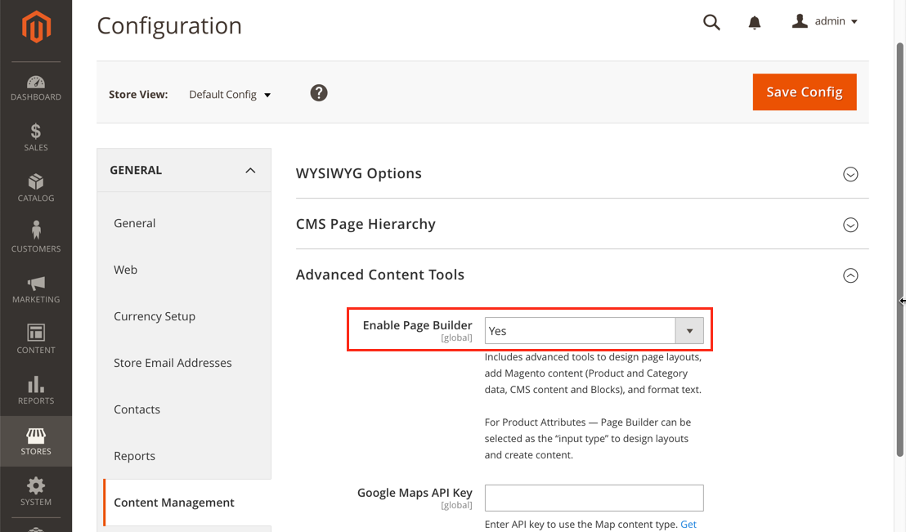

# Activate and deactivate Page Builder

<!--  -->

## Activate Page Builder

Follow these steps to activate PageBuilder in the Admin:

1. Navigate to the Admin section of you Magento instance.
2. In the **Stores** tab, select **Configuration** under the Settings group.
3. In the **General** group on the page, select **Content Management**.
4. Under **Advanced Content Tools**, select **Yes** for **Enable Page Builder**.

   
   
5. Click **Save Config**

## Deactivate Page Builder

> NOTE: We recommend you deactivate the PageBuilder editor through the Admin UI instead of disabling the module through the CLI using `bin/magento`. If you use the CLI, you could break various layouts, for example, the full width layouts. Deactivating from the Admin UI allows the PageBuilder module to continue rendering the content on the storefront even if the editor is not used in the Admin.

If you disabled or uninstalled the entire PageBuilder module instead of just the editor, you need to do the following to continue using PageBuilder-built content:

1. Implement PageBuilder widgets and initialize them on dynamic blocks since JavaScript functionality provided by PageBuilder will no longer work.
2. Change the layout in the database for entities that use the full width layout to prevent blank layout content.

<!--  -->
