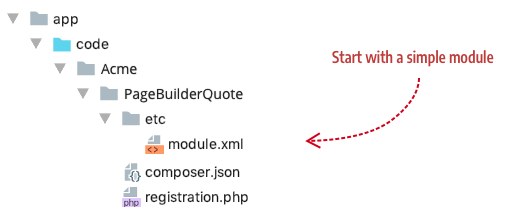
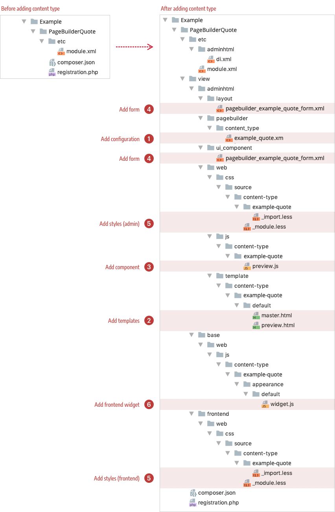

# How to develop a new content type

<!--  -->

Out of the box, Page Builder comes with several content types (controls) that you can drag onto the stage to build your storefront pages, as shown below. In this topic, you will learn how to create your own content type for use within Page Builder.


## Prerequisites

Page Builder creates content types from modules. So this topic assumes you have a basic module structure in which to add your content type files.



## Overview

The steps for creating a Page Builder content type are briefly outlined here. The remainder of this topic describes these steps in detail.





## Step 1: Add a configuration

Adding a new content type starts with an XML [configuration](content-type-configuration.md) file.

To add configuration for a new content type, create a file under the following location `Vendor\ModuleName\view\adminhtml\pagebuilder\content_type\simple.xml` with the following content:

``` XML
<config xmlns:xsi="http://www.w3.org/2001/XMLSchema-instance" xsi:noNamespaceSchemaLocation="urn:magento:module:Vendor_ModuleName:etc/content_type.xsd">
    <type name="simple"
          label="Simple"
          component="Vendor_ModuleName/js/content-type"
          form="modulename_simple_form"
          group="layout"
          icon="icon-modulename-simple"
          sortOrder="35"
          translate="label">
        <parents default_policy="deny">
            <parent name="row" policy="allow"/>
        </parents>
        <appearances>
            <appearance default="true"
                        name="default"
                        preview_template="Vendor_ModuleNameCustom/content-type/simple/default/preview"
                        render_template="Vendor_ModuleNameCustom/content-type/simple/default/master"
                        reader="Magento_PageBuilder/js/master-format/read/configurable">
                <elements>
                    <element name="main">
                        <style name="text_align" source="text_align"/>
                        <style name="border" source="border_style"/>
                        <style name="border_color" source="border_color" converter="Magento_PageBuilder/js/converter/style/color"/>
                        <style name="border_width" source="border_width" converter="Magento_PageBuilder/js/converter/style/border-width"/>
                        <style name="border_radius" source="border_radius" converter="Magento_PageBuilder/js/converter/style/remove-px"/>
                        <style name="margins" storage_key="margins_and_padding" reader="Magento_PageBuilder/js/property/margins" converter="Magento_PageBuilder/js/converter/style/margins"/>
                        <style name="padding" storage_key="margins_and_padding" reader="Magento_PageBuilder/js/property/paddings" converter="Magento_PageBuilder/js/converter/style/paddings"/>
                        <attribute name="name" source="data-role"/>
                        <css name="css_classes"/>
                    </element>
                </elements>
            </appearance>
        </appearances>
    </type>
</config>
```

In this example, content type has only one element in the template.

## Step 2: Add a template

Let's create templates specified in the configuration. 

Optional: For template knockout bindings, you can use the original data-bind syntax, or utilize Magento custom Knockout.js bindings as seen in the template snippets below. `http://devdocs.magento.com/guides/v2.2/ui_comp_guide/concepts/knockout-bindings.html`

Preview template `app/code/Vendor/ModuleName/view/adminhtml/web/template/content-type/simple/default/preview.html`.

``` HTML
<div class="pagebuilder-content-type" event="{mouseover: onMouseOver, mouseout: onMouseOut}, mouseoverBubble: false">
    <div attr="data.main.attributes" ko-style="data.main.style" css="data.main.css" html="data.main.html"></div>
    <!-- Display context menu options for content type -->
    <render args="getOptions().template" />
</div>
```

And master template `app/code/Vendor/ModuleName/view/adminhtml/web/template/content-type/simple/default/master.html`.

``` HTML
<div attr="data.main.attributes" ko-style="data.main.style" css="data.main.css" html="data.main.html"></div>
```

In the `simple.xml` above we defined border attributes and form for component. 

## Step 3: Add a component

If your content type has custom preview logic, you need to specify `preview_component`, otherwise the default one `Magento_PageBuilder/js/content-type/preview` will be used.

If your content type can have other components as children, you need to extend `Magento_PageBuilder/js/content-type/preview-collection` component. Otherwice you need to extend `Magento_PageBuilder/js/content-type/preview`.

In the preview component you can add custom logic that will be available in the template. You can also do modifications to observables used in preview template if you override `afterObservablesUpdated` method. 

Let's add a button in the preview that would display `Hello World` on click.

```js
define(["Magento_PageBuilder/js/content-type/preview"], function (Preview) {
    var Simple = function() {
        Preview.apply(this, arguments);
    };

    Simple.prototype = Object.create(Preview.prototype);
    Simple.prototype.constructor = Simple;

    /**
     * Alert Hello World
     */
    Simple.prototype.helloWorld = function() {
        alert("Hello World");
    };

    return Simple;
});
```


## Step 4: Add an icon


## Step 5: Add a form

Let's create form `Vendor/ModuleName/view/adminhtml/ui_component/modulename_simple_form.xml` which enables the user to modify these attributes from the admin.

``` XML
<form xmlns:xsi="http://www.w3.org/2001/XMLSchema-instance" xsi:noNamespaceSchemaLocation="urn:magento:module:Magento_Ui:etc/ui_configuration.xsd" extends="pagebuilder_base_form">
    <argument name="data" xsi:type="array">
        <item name="js_config" xsi:type="array">
            <item name="provider" xsi:type="string">modulename_simple_form.modulename_simple_form_data_source</item>
        </item>
        <item name="label" xsi:type="string" translate="true">Simple</item>
    </argument>
    <settings>
        <deps>
            <dep>modulename_simple_form.modulename_simple_form_data_source</dep>
        </deps>
        <namespace>modulename_simple_form</namespace>
    </settings>
    <dataSource name="modulename_simple_form_data_source">
        <argument name="data" xsi:type="array">
            <item name="js_config" xsi:type="array">
                <item name="component" xsi:type="string">Magento_PageBuilder/js/form/provider</item>
            </item>
        </argument>
        <dataProvider name="modulename_simple_form_data_source" class="Magento\PageBuilder\Model\ContentBlock\DataProvider">
            <settings>
                <requestFieldName/>
                <primaryFieldName/>
            </settings>
        </dataProvider>
    </dataSource>
    <fieldset name="appearance_fieldset" component="Magento_PageBuilder/js/form/element/dependent-fieldset">
        <settings>
            <label translate="true">Appearance</label>
            <collapsible>true</collapsible>
            <opened>true</opened>
            <imports>
                <link name="hideFieldset">${$.name}.appearance:options</link>
                <link name="hideLabel">${$.name}.appearance:options</link>
            </imports>
        </settings>
        <field name="appearance" sortOrder="10" formElement="select" component="Magento_PageBuilder/js/form/element/dependent-select">
            <argument name="data" xsi:type="array">
                <item name="config" xsi:type="array">
                    <item name="default" xsi:type="string">default</item>
                </item>
            </argument>
            <settings>
                <dataType>text</dataType>
                <label translate="true">Appearance</label>
                <validation>
                    <rule name="required-entry" xsi:type="boolean">true</rule>
                </validation>
            </settings>
            <formElements>
                <select>
                    <settings>
                        <options>
                            <option name="0" xsi:type="array">
                                <item name="value" xsi:type="string">default</item>
                                <item name="label" xsi:type="string" translate="true">Default</item>
                            </option>
                        </options>
                    </settings>
                </select>
            </formElements>
        </field>
    </fieldset>
    <fieldset name="advanced">
        <field name="margins_and_padding">
            <argument name="data" xsi:type="array">
                <item name="config" xsi:type="array">
                    <item name="default" xsi:type="string">{"margin":{"top":"","right":"","bottom":"","left":""},"padding":{"top":"","right":"","bottom":"","left":""}}</item>
                </item>
            </argument>
        </field>
    </fieldset>
</form>
```

Every form should have default appearance to allow other modules to add more appearances.

Attributes that we want to edit as part of the advanced section are defined in `pagebuilder_base_form`, so we can just extend it.

## Step 6: Add a layout

And to allow this form to be loaded in PageBuilder, let's create layout `Vendor/ModuleName/view/adminhtml/layout/pagebuildercustom_simple_form.xml`.

``` XML
<page xmlns:xsi="http://www.w3.org/2001/XMLSchema-instance" layout="admin-1column" xsi:noNamespaceSchemaLocation="urn:magento:framework:View/Layout/etc/page_configuration.xsd">
    <update handle="styles"/>
    <body>
        <referenceContainer name="content">
            <uiComponent name="modulename_simple_form"/>
        </referenceContainer>
    </body>
</page>
```


## Step 7: Add a frontend widget

 


## Preview, PreviewCollection, Content, and ContentCollection

And the last part is to add button to a template.

``` HTML
<render args="getOptions().template" />
<button type="button" click="helloWorld" translate="'Display Hello World'"/>
```

Now, let's add content type that can contain other content types. Create configuration `Vendor\ModuleName\view\adminhtml\pagebuilder\content_type\complex.xml`.

``` XML
<config xmlns:xsi="http://www.w3.org/2001/XMLSchema-instance" xsi:noNamespaceSchemaLocation="urn:magento:module:Magento_PageBuilder:etc/content_type.xsd">
    <type name="complex"
          label="Complex"
          component="Magento_PageBuilder/js/content-type-collection"
          preview_component="Magento_PageBuilder/js/content-type/preview-collection"
          master_component="Magento_PageBuilder/js/content-type/content-collection"
          form="vendorname_complex_form"
          group="layout"
          icon="icon-vendorname-complex"
          sortOrder="35"
          translate="label">
        <children default_policy="deny">
            <child name="heading" policy="allow"/>
        </children>
        <appearances>
            <appearance default="true"
                        name="default"
                        preview_template="Vendor_ModuleName/content-type/complex/default/preview"
                        render_template="Vendor_ModuleName/content-type/complex/default/master"
                        reader="Magento_PageBuilder/js/master-format/read/configurable">
                <elements>
                    <element name="main">
                        <style name="text_align" source="text_align"/>
                        <style name="border" source="border_style"/>
                        <style name="border_color" source="border_color" converter="Magento_PageBuilder/js/converter/style/color"/>
                        <style name="border_width" source="border_width" converter="Magento_PageBuilder/js/converter/style/border-width"/>
                        <style name="border_radius" source="border_radius" converter="Magento_PageBuilder/js/converter/style/remove-px"/>
                        <style name="margins" storage_key="margins_and_padding" reader="Magento_PageBuilder/js/property/margins" converter="Magento_PageBuilder/js/converter/style/margins"/>
                        <style name="padding" storage_key="margins_and_padding" reader="Magento_PageBuilder/js/property/paddings" converter="Magento_PageBuilder/js/converter/style/paddings"/>
                        <attribute name="name" source="data-role"/>
                        <css name="css_classes"/>
                    </element>
                </elements>
            </appearance>
        </appearances>
    </type>
</config>
```

Now need to create preview and render templates.

`Vendor/ModuleName/view/adminhtml/web/template/content-type/complex/default/preview.html`

``` HTML
<div class="pagebuilder-content-type type-container pagebuilder-complex children-min-height" attr="data.main.attributes" ko-style="data.main.style" css="data.main.css" event="{mouseover: onMouseOver, mouseout: onMouseOut }, mouseoverBubble: false">
    <render args="getOptions().template" />
    <render args="previewChildTemplate" />
</div>
```

`Vendor/ModuleName/view/adminhtml/web/template/content-type/complex/default/master.html`
``` HTML
<div attr="data.main.attributes" ko-style="data.main.style" css="data.main.css">
    <render args="renderChildTemplate" />
</div>
```

Please also notice that we specified in configuration the following, to allow our content type accept other content types as children.

| Setting             | Value                                                       |
| ------------------- | ----------------------------------------------------------- |
| `component`         | Magento_PageBuilder/js/content-type-collection              |
| `preview_component` | Magento_PageBuilder/js/content-type/preview-collection      |
| `master_component`  | Magento_PageBuilder/js/content-type/content-collection      |

You can also specify `content_component` if you want to do modifications to observables used in master format templates.


## component, preview_component and content_component

`component` is structure element. If your content type can contain children use `Magento_PageBuilder/js/content-type-collection`, otherwise use `Magento_PageBuilder/js/content-type`. You may extend default `component` if you want to dispatch additional or subscribe to existing events.

`preview_component` contains preview logic that is generic for all appearances. If `preview_component` not specified, the default one `Magento_PageBuilder/js/content-type/preview` will be used. If your content type can have other components as children, you need to specify `Magento_PageBuilder/js/content-type/preview-collection`.

You can also do modifications to observables used in preview template if you override `afterObservablesUpdated` method. 

`content_component` contains master format rendering logic that is generic for all appearances. If `content_component` not specified, the default one `Magento_PageBuilder/js/content-type/content` will be used. If your content type can have other components as children, you need to specify `Magento_PageBuilder/js/content-type/content-collection`. If you need to do modifications to observables used in preview template if you override `afterObservablesUpdated` method.

## Config

Sometimes you need to have access to other content types configuration in your component or stage configuration. This configuration available via `Magento_PageBuilder/js/component/config`.

Config have the following methods

| Method                 | Description                                                                                     |
| ---------------------- | ----------------------------------------------------------------------------------------------- |
| `setConfig`            | Method is used for initial initialization of the config, not expected to be used by developers. |
| `getConfig`            | Returns the whole configuration as object.                                                      |
| `getContentTypeConfig` | Retrieves configuration for specific content type.                                              |

## Fix rendering issues on the stage

The master format can appear on the stage when PageBuilder content is embedded into a CMS block and the block is then added to a page via the block content type. This may cause rendering issues on the stage if your customizations do not support this behavior.

You can easily avoid these potential rendering issues by either:
* [Modifying your preview styles to support your master format.](#modify-preview-styles-to-support-master-format)
* [Copying your master format styles to the preview styles.](#copy-master-format-styles-to-preview-styles)

### Modify preview styles to support master format

Depending on the complexity of your customizations, everything may render correctly without any modification to the preview styles to support your master format.

### Copy master format styles to preview styles

If you have a very complex content type with a substantially different preview and master formats, copying your master format styles to the preview styles is the best and most efficient option.

If you are customizing a preview renderer that can contain PageBuilder content, such as the native block content type, you must invoke the widget initializer logic to cause the master format content to initialize correctly. To accomplish this, include the widget initializer in your component and invoke it with the configuration.

**Example:**

For a container that renders master format content, add an `afterRender` binding to initialize the widgets:

``` html
<div html="someVariable" afterRender="initializeWidgets"/>
```

Your component's `initializeWidgets` method would resemble:

``` javascript
define(["Magento_PageBuilder/js/widget-initializer", "Magento_PageBuilder/js/config"], function (widgetInitializer, config) {
    return {
        initializeWidgets: function initializeWidgets() {
            widgetInitializer({
                config: config.getConfig("widgets")
            });
        }
    };
});
```

<!--  -->